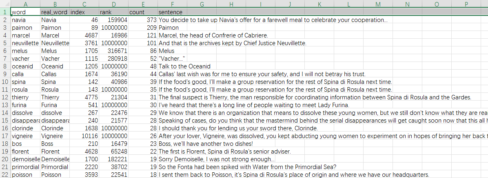
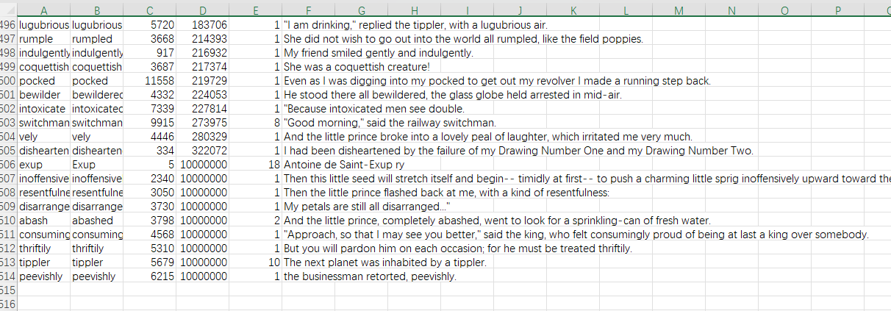

# Difficult-Words

Difficult-Words is a Python-based tool designed to detect and analyze difficult English words within a given text. The tool provides information such as the simplified form of the word, the true form, index of the word's first appearance, rank based on frequency in a large dataset, count of occurrences in the text, and the sentence in which the word appears.

## Installation

1. Ensure you have Python installed on your system.

2. Double click `set_up_venv.bat` to set up a virtual environment.

3. Double click `run_in_venv.bat` to process the text and extract difficult words.

    Note: The first time you run the script `run_in_venv.bat` , it will download NLTK data (approximately 70MB). Users in some countries may need to use a VPN to overcome any download restrictions.

## Configuration

You can modify the `run_in_venv.bat` script to customize the processing parameters according to your needs. Change the following line to specify your input text file, output CSV file, and other parameters:

```bash
python %CURRENT_DIR%src\main.py --threshold 13000 --input "./demo/As Light Rain Falls Without Reason.txt" --output "output.csv" --sort_by "count"
```

Replace `--input`, `--output`, and other parameters with your desired file names and options.

## Output Format

The output CSV file will contain the following columns for each difficult word detected:

1. `word`: The simplified form of the word.
2. `real_word`: The true form of the word.
3. `index`: The index of the word's first appearance in the text.
4. `rank`: The rank of the word based on frequency in a large dataset.
5. `count`: The number of times the word appears in the text.
6. `sentence`: The sentence in which the word appears.

## Example

Here is the result for "As Light Rain Falls Without Reason.txt", part of the lines from a well-known online game.





Here is the whole file.
[output_archive.csv](demo/output_archive.csv)

Note that `rank=10,000,000` means that this word  is not in the database.

Feel free to explore and integrate Difficult-Words into your projects or workflows!